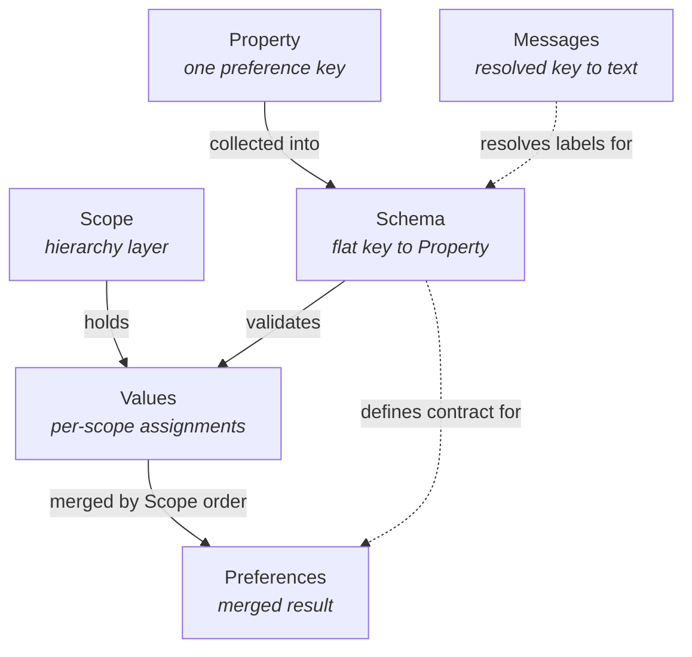

# Preferences Specification

This spec describes how to define preferences and how to resolve their final
values when several layers can contribute.

A preferences system has two halves:

- **The Schema** — what preferences exist. Each `Property` declares its key,
  default, owning `scope`, and whether it is `overridable`. The `Schema` is a
  flat map from property key to `Property`.
- **Values, per scope** — what is actually set. Each `Scope` (for example
  `system`, `global`, `application`, `user`) can hold its own assignments.
  Scopes are ordered from most general to most specific.

The final `Preferences` are produced by merging the per-scope values in scope
order, while respecting each property's rules (default, owning scope,
`overridable`).

This document is schema-focused. Transport, storage, mutation protocols,
authorization policy, locale selection, and how multiple contributors are merged
into a single `Schema` and `Messages` bag are out of scope — though
authorization typically maps to scopes, with more general scopes requiring more
permissions to write.

Reference model: [VS Code Configuration
schema](https://code.visualstudio.com/api/references/contribution-points#Configuration-schema)

## Core Terminology

- **Property**: one schema entry for a single preference key.
- **Schema**: the full property contract — a flat map from property key to
  `Property`.
- **Messages**: a flat map from message key to display text. Already resolved
  for one locale by the host before reaching the runtime.
- **Scope**: one layer in the host-defined merge hierarchy.
- **Values**: per-scope assignments to `Property` keys.
- **Preferences**: final effective values after hierarchical merge.



In short: properties are collected into a flat `Schema`; values are authored per
scope; preferences are the merged result; messages resolve display labels for
property and group keys.

### Resolution Inputs and Output

To compute `Preferences`, the resolver needs:

- An ordered list of `scopes` (merge precedence).
- The full `Schema` (a flat map; each `Property` must define `scope` and
  `overridable`).
- A `values` object keyed by `scope`, where each value is a key-value map of
  property assignments for that layer.

From these inputs, the resolver merges by `scope` order, applies `overridable`,
falls back to defaults, validates against the `Schema`, and produces final
`Preferences`.

Example (simplified types — only the fields the resolver consumes; the full
`Property` contract is defined later):

```ts
type Property = {
  scope: string;
  overridable: boolean;
  default?: unknown;
};

type Schema = Record<string, Property>;

type Values = Record<string, Record<string, unknown>>;

function resolve(scopes: string[], schema: Schema, values: Values) {

  const keys = new Set(Object.keys(schema));

  const unknownKeyWarnings = scopes.flatMap((scope) =>
    Object.keys(values[scope] ?? {})
      .filter((key) => !keys.has(key))
      .map((key) => `Unknown property key "${key}" in scope "${scope}".`)
  );

  const entries = Object.entries(schema).map(
    ([key, property]) => {

      const propertyScopeIndex = scopes.indexOf(property.scope);
      if (propertyScopeIndex === -1) {
        return {
          key,
          value: undefined,
          warning: `Property "${key}" declares unknown scope "${property.scope}".`
        };
      }

      const startValue = values[property.scope]?.[key] ?? property.default;

      const resolvedValue = property.overridable
        ? scopes.slice(propertyScopeIndex + 1).reduce((current, scope) => {
            const scopedValue = values[scope]?.[key];
            return scopedValue ?? current;
          }, startValue)
        : startValue;

      return { key, value: resolvedValue, warning: undefined };

    }
  );

  const preferences = Object.fromEntries(
    entries
      .filter((entry) => entry.value !== undefined)
      .map(({ key, value }) => [key, value]),
  );

  const schemaWarnings = entries
    .map((entry) => entry.warning)
    .filter((warning): warning is string => Boolean(warning));

  return { preferences, warnings: [...unknownKeyWarnings, ...schemaWarnings] };

}
```

## Inputs

The runtime accepts three values, all flat:
 
### Schema

```json
  {
    "ar.alignment": {
      "type": "string",
      "scope": "system",
      "overridable": true,
      "enum": ["left", "center", "right"],
      "enumLabels": [
        "%ar.alignment.left%",
        "%ar.alignment.center%",
        "%ar.alignment.right%"
      ],
      "default": "left",
      "description": "%ar.alignment.description%"
    }
  }
```

### Messages 

Already resolved for the active locale.

```json
{
  "ar": "AR",
  "ar.alignment": "Alignment",
  "ar.alignment.description": "Text alignment",
  "ar.alignment.left": "Left",
  "ar.alignment.center": "Center",
  "ar.alignment.right": "Right"
}
```

### Values

```json
{
  "system": { "ar.alignment": "left" },
  "user":   { "ar.alignment": "center" }
}
```

## Property Contract

Each `Property` in the `Schema` must define:

- `type` (required): one of `boolean`, `integer`, `number`, `string`, `array`,
  `object`, or `any`.
- `items` (required when `type: "array"`): object with `type` equal to
  `boolean`, `integer`, `number`, `string`, `object`, or `any`. Nested arrays
  are not supported; use `any` if items may themselves be arrays.
- `scope` (required): see `Scope and override semantics` below.
- `overridable` (required boolean): see `Scope and override semantics` below.
Optional shared metadata:

- `default` (optional): the fallback value when no scope authors a value. When
  present, must satisfy `type`, `items`, declared constraints, and `enum` —
  see `Property Checks`. When absent, and no scope authors a value, the
  property is omitted from the resolved `Preferences`.
- `description` (optional, key-or-text): a `%key%` reference resolved from
  `Messages`, or literal Markdown text. When omitted, no description is
  rendered. See `Messages Contract` for the resolution rules.
- `deprecationMessage` (optional, key-or-text): see `description`.
- `order` (optional number): used to order siblings in the hierarchical display.
  See `Hierarchical Display Expectations`.

Scope and override semantics:

- `scope` selects the baseline layer where resolution begins for that property.
  Values authored at scopes earlier in the host's order than the property's
  `scope` are ignored; the resolver emits a warning.
- Scope order is host-defined (example profile: `system -> global -> application
  -> user`).
- `overridable: true` allows downstream scopes (those after `scope` in the
  host's order) to replace the value.
- `overridable: false` locks the value at its own `scope` (or `default` if
  missing there). Values authored at downstream scopes for non-overridable
  properties are ignored; the resolver emits a warning.

## Messages Contract (Optional)

`Messages` is optional. When provided, resolved text is interpreted as Markdown.

`Messages` is a single flat map from message key to display text. It is already
resolved for one locale before it reaches the runtime. **Locale selection,
locale fallback, and merging multiple per-locale catalogs into a single resolved
bag are host concerns**, outside the scope of this contract. The host produces
the right `Messages` for the active locale and passes it in.

### Key Reference Syntax

Message keys are referenced with `%key%` syntax. A string is treated as a key
reference when, and only when, it matches the regular expression:

```
^%[A-Za-z][A-Za-z0-9._-]*%$
```

That is: a single `%` character, an identifier starting with a letter and using
`A–Z`, `a–z`, `0–9`, `.`, `_`, or `-`, and a closing `%`. Strings that do not
match (including `%%`, `%foo`, `foo%`, strings with whitespace, and anything
containing additional characters outside the wrapping `%...%`) are literal
Markdown text.

Fields that accept this key-or-text form (collectively, **key-or-text fields**):

- `description` (on every `Property`)
- `deprecationMessage` (on every `Property`, when present)
- each entry of `enumLabels` (when present)
- each entry of `enumDescriptions` (when present)

In addition, the hierarchical display resolves group-node and property labels by
direct key lookup (the full node key, e.g. `editor.font` or `editor.font.size`).
These are *not* key-or-text fields and do not use the `%...%` syntax — the
lookup is implicit in the tree structure. See `Hierarchical Display
Expectations`.

### Resolution Algorithm

The same resolution algorithm is used for both key-or-text fields and tree
labels. It takes a message key `K` and produces display text:

1. If `messages` is present and `messages[K]` is a non-empty string, render
   `messages[K]`.
2. Otherwise, render a fallback label derived from the last period-delimited
   segment of `K`:
   - capitalize the first letter,
   - split camelCase boundaries into spaces.

   Example: `backgroundColor` → "Background color".

   Emit a warning recording the missing key.

Entry points:

- **Key-or-text field**: if the field value matches the `%K%` syntax above, run
  the algorithm with the inner `K`. Otherwise, render the field value as literal
  Markdown.
- **Tree label** (group node or property): run the algorithm with the node's
  full structural key as `K`.

Missing keys emit warnings but never invalidate a `Schema`.

### Messages Shape

```json
{
  "ar": "AR",
  "ar.alignment": "Alignment",
  "ar.alignment.description": "Text alignment",
  "ar.alignment.left": "Left",
  "ar.alignment.center": "Center",
  "ar.alignment.right": "Right"
}
```

## Supported Types

### Scalar Types

- `boolean`
- `integer`: a finite JSON number with no fractional part.
- `number`: a finite JSON number (integer or fractional).
- `string`

### Array Types

- `type: "array"` with `items.type: "boolean"`
- `type: "array"` with `items.type: "integer"`
- `type: "array"` with `items.type: "number"`
- `type: "array"` with `items.type: "string"`
- `type: "array"` with `items.type: "object"`
- `type: "array"` with `items.type: "any"`

### Object and Any

- `object`: a JSON object (`{}`). The schema does not validate the internal
  shape; consumers are responsible for interpreting it.
- `any`: any JSON value (primitive, array, or object). Used as the escape valve
  when no shape can be guaranteed — including arrays of arrays, mixed-shape
  lists, or values whose form varies across scopes.

`object` and `any` carry no type-specific constraints (no `minimum`, `pattern`,
`enum`, etc.).

## Scalar Constraints

A scalar value (a value of type `boolean`, `integer`, `number`, or `string`)
admits a fixed set of constraint fields. These constraints live where the
scalar `type` is declared:

- For scalar properties (`type` ∈ `{boolean, integer, number, string}`), the
  constraints live at the property root and apply to the property value.
- For array properties (`type: "array"`), the constraints live on `items` and
  apply to each element. The array itself has its own length constraints
  (`minItems`/`maxItems`) at the property root.

### Enum-Compatible Constraints

The `enum` field is only valid when the in-context `type` is `integer` or
`string`. Declaring `enum` (or `enumLabels`, `enumDescriptions`) on any other
type is invalid and the validator emits an error. The same rule applies whether
declared at the root or on `items`.

Enum behavior is represented with:

- `enum`: list of allowed values.
- `enumLabels` (optional): array aligned by index with `enum`. Each entry is a
  short display label for the option (key-or-text: resolved as a message key
  first, falling back to literal Markdown text). When absent, the literal `enum`
  value is used as the label.
- `enumDescriptions` (optional): array aligned by index with `enum`. Each entry
  is longer per-option help text (key-or-text). When absent, no help text is
  rendered for the option.

### Numeric Constraints

Valid only when the in-context `type` is `integer` or `number`:

- `minimum` (inclusive lower bound): the value must be greater than or equal to
  `minimum`.
- `maximum` (inclusive upper bound): the value must be less than or equal to
  `maximum`.

For `integer` properties, `minimum` and `maximum` should themselves be whole
numbers.

### String Constraints

Valid only when the in-context `type` is `string`:

- `minLength`
- `maxLength`
- `pattern`
- `patternErrorMessage`
- `format` (a named string format). The canonical names are `date`, `time`,
  `email`, `ipv4`, `ipv6`, `uri`, and `uuid`, but `format` is **not** restricted
  to this set — any name is allowed. `format` is enforced only **at runtime**:
  the consumer supplies one validator per format name, and a value is checked
  against the validator for its declared format. A declared `format` with no
  supplied validator fails (the value is treated as not passing), surfacing an
  `invalid_format` issue. The Schema Validator does not check `default` against
  `format`.

### Array Length Constraints

`minItems` and `maxItems` are array-shape constraints (not element constraints)
and live at the property root for array properties only.

## Composition (Non-Normative)

Producing a single `Schema` from multiple contributors, and producing a single
`Messages` bag for the active locale from one or more per-locale catalogs, is
**host policy**. This contract describes only the runtime inputs and outputs.
The runtime does not ship a composition step.

When a host does compose, recommended practice is:

1. Choose a single, deterministic merge order (e.g. static registry order, or
   explicit numeric priority then contributor id lexicographically).
2. Detect and surface property-key collisions across contributors.
3. Detect and surface message-key collisions across contributors.
4. Reject collisions unless an explicit override policy is configured.
5. Publish the composed `Schema` and `Messages` only when validation passes.

### Property Key Ownership

- Property keys are globally unique in the composed `Schema`.
- Contributors should namespace keys (example: `ar.*`, `billing.*`, `editor.*`).
- A contributor cannot redefine another contributor's key unless an override
  policy allows it.

## Validation Contract

A `Schema` is valid only when all checks pass.

### Property Checks

For every property:

- The property key contains at least two period-delimited segments (e.g.
  `editor.color`). Single-segment keys (e.g. `color`) are invalid.
- `type` is one of `boolean`, `integer`, `number`, `string`, `array`, `object`,
  or `any`.
- If `type` is `array`, `items.type` is one of `boolean`, `integer`, `number`,
  `string`, `object`, or `any`.
- `scope` exists and is a non-empty string.
- `overridable` exists and is a boolean.
- If `description` exists, it is a non-empty string.
- If `deprecationMessage` exists, it is a non-empty string.
- If `order` exists, it is a number.

Default value checks (when `default` is present):

- `default` matches `type`:
  - `boolean`: `true` or `false`.
  - `integer`: a finite JSON number with no fractional part.
  - `number`: a finite JSON number.
  - `string`: a JSON string.
  - `array`: a JSON array; each element matches `items.type` (and, for typed
    item types, the element-level type rules above).
  - `object`: a JSON object (not an array).
  - `any`: any JSON value.
- If `enum` exists, `default` is a member of `enum`.
- `default` satisfies all type-specific constraints declared on the property
  (`minimum`, `maximum`, `minLength`, `maxLength`, `pattern`, `minItems`,
  `maxItems`). `format` is **not** checked here — it is enforced only at runtime
  against consumer-supplied validators (see `String Constraints`).

When `default` is absent and no scope authors a value, the property is omitted
from the resolved `Preferences`. Consumers should treat absence as "not
configured."

Enum checks:

- If `enum` exists, `type` is `integer` or `string`.
- If `enumLabels` exists, its length equals `enum.length` and each entry is a
  non-empty string.
- If `enumDescriptions` exists, its length equals `enum.length` and each entry
  is a non-empty string.

### Constraint Consistency

- `minimum <= maximum` when both exist.
- `minLength <= maxLength` when both exist.
- `minItems <= maxItems` when both exist.
- `pattern` must be a valid regular expression when present.

### Composed Schema Checks

- Property keys are globally unique after composition.
- No property key is also a group node; i.e. no property key is a strict prefix
  (segment-aligned) of another property key. For example, `editor.font.size` and
  `editor.font.color` are valid together, but `editor.font` cannot also be a
  property when either of those exists.
- Conflicts are either rejected or resolved by explicit policy.
- Composition (host-side) remains deterministic for the same input set.

### Messages Coverage

When `Messages` is supplied, the following keys **should** exist in it. Missing
keys do not invalidate a `Schema`; they emit warnings and the resolver applies
the literal-text or derived-label fallback per `Messages Contract` and
`Hierarchical Display Expectations`.

- For each key-or-text field (`description`, `deprecationMessage`, every entry
  of `enumLabels`, every entry of `enumDescriptions`), when present: if the
  field value matches `%X%`, the key `X` should exist.
- For each property key, a message at that exact key should exist (used as the
  property's tree label).
- For each group node (every period-delimited prefix of a property key that is
  itself the prefix of at least one property), a message at that exact key
  should exist (used as the group node's tree label).

## Values and Preferences

`Values` are instance assignments authored per scope. `Preferences`
are the effective merged result.

Example values:

```json
{
  "system": {
    "ar.alignment": "left"
  },
  "application": {
    "ar.alignment": "center"
  },
  "user": {
    "editor.fontSize": 16
  }
}
```

Example effective preferences:

```json
{
  "ar.alignment": "center",
  "ar.enableHints": false,
  "editor.fontSize": 16
}
```

Rules:

- Unknown keys may be rejected or ignored by host policy.
- Known keys must satisfy the composed schema `type` and constraints.
- Omitted keys fall back to each `Property`'s `default` when present.
- When no scope authors a value and the property declares no `default`, the
  property is omitted from the resolved `Preferences`. The output JSON does not
  contain that key.
- A `null` value is treated identically to an absent key — the resolver behaves
  as if the key were not authored at that `Scope` and continues with the
  standard fallback.

## Worked Examples

### Example Schema

```json
{
  "ar.alignment": {
    "type": "string",
    "scope": "system",
    "overridable": true,
    "enum": ["left", "center", "right"],
    "enumLabels": [
      "%ar.alignment.left%",
      "%ar.alignment.center%",
      "%ar.alignment.right%"
    ],
    "default": "left",
    "description": "%ar.alignment.description%"
  },
  "ar.enableHints": {
    "type": "boolean",
    "scope": "user",
    "overridable": false,
    "default": false,
    "description": "%ar.enableHints.description%"
  },
  "editor.fontSize": {
    "type": "number",
    "scope": "user",
    "overridable": false,
    "minimum": 10,
    "maximum": 32,
    "default": 14,
    "description": "%editor.fontSize.description%"
  }
}
```

### Example Messages (English)

```json
{
  "ar": "AR",
  "ar.alignment": "Alignment",
  "ar.alignment.description": "Alignment mode",
  "ar.alignment.left": "Left",
  "ar.alignment.center": "Center",
  "ar.alignment.right": "Right",
  "ar.enableHints": "Enable hints",
  "ar.enableHints.description": "Enable helper hints",
  "editor": "Editor",
  "editor.fontSize": "Font size",
  "editor.fontSize.description": "Editor font size in pixels"
}
```

### Example Validation Errors

- `INVALID_DEFAULT_TYPE`: `editor.fontSize` default `"14"` is not a number.
- `ENUM_DEFAULT_MISMATCH`: `ar.alignment` default `"justify"` is not in enum.
- `PROPERTY_KEY_CONFLICT`: `ar.enableHints` is declared by multiple contributors
  (host-side composition).
- `GROUP_PROPERTY_COLLISION`: `editor.font` is both a property and a group
  prefix.

## Extensibility Rules

- Consumers ignore unknown non-critical metadata fields.
- Extension metadata should use a stable, documented naming convention.
- Producers do not change meaning of existing fields without a version bump.
- New optional fields can be added without breaking older consumers.
- New property types require explicit platform support and validator updates.

## Hierarchical Display Expectations

The GUI groups and orders properties by their period-delimited key segments.
Structural rules on property keys (at least two segments, no overlap between
properties and group nodes) are normative and enforced by the `Validation
Contract` (see `Property Checks` and `Composed Schema Checks`).

### Tree Structure

- Any prefix that appears before another segment of a property key
  is a **group node**.
- Group nodes are derived from property keys and are not themselves
  properties.

Tree construction example.

Input properties:

- `editor.color`
- `editor.backgroundColor`
- `editor.font.size`
- `editor.font.color`

Rendered hierarchy:

- `[+] editor`
  - `color`
  - `backgroundColor`
  - `[+] font`
    - `size`
    - `color`

### Label Resolution

Display labels for both group nodes and property keys are resolved by running
the algorithm in `Messages Contract → Resolution Algorithm` with the node's full
structural key (`editor`, `editor.font`, `editor.font.size`, etc.) as `K`. The
`%...%` syntax does *not* apply here — the structural key is the lookup key.

Group nodes and property keys **should** have a message at that exact key (see
`Messages Coverage`); when missing, the segment-derived fallback is used and a
warning is emitted.

Sorting by label uses the resolved label string, compared case-insensitively.

### Ordering Rules

1. Every property may declare an `order` number.
2. Group node order is the minimum `order` among descendant properties that
   define `order`.
3. If a node has no order (property without `order`, or group with no descendant
   order), treat its order as a very large value so it is sorted after all
   explicitly ordered nodes.
4. Sort by effective order ascending.
5. When effective order is the same, sort lexicographically by label
   (case-insensitive).

## Non-Goals

This specification does not define:

- transport protocol (REST/GraphQL/etc.),
- persistence/storage strategy,
- runtime dirty-tracking or patch semantics,
- authorization policy for preference mutations,
- locale selection or fallback across locales,
- composing per-contributor schemas into a single `Schema`.
- merging multi-locale message catalogs into a single resolved `Messages` bag,
